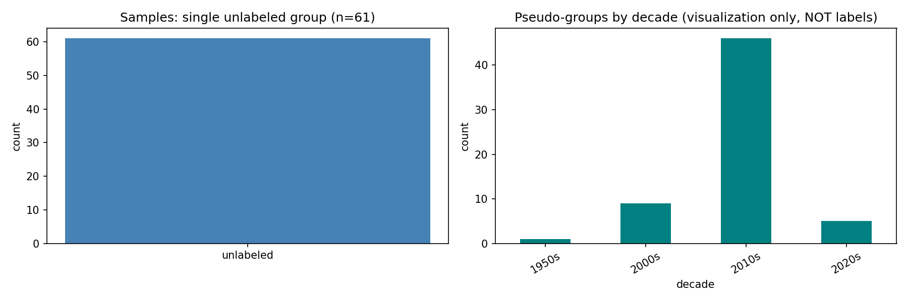
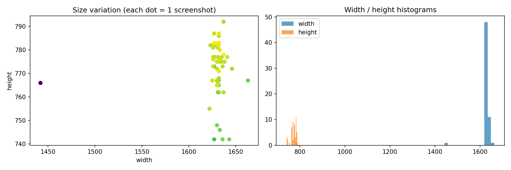
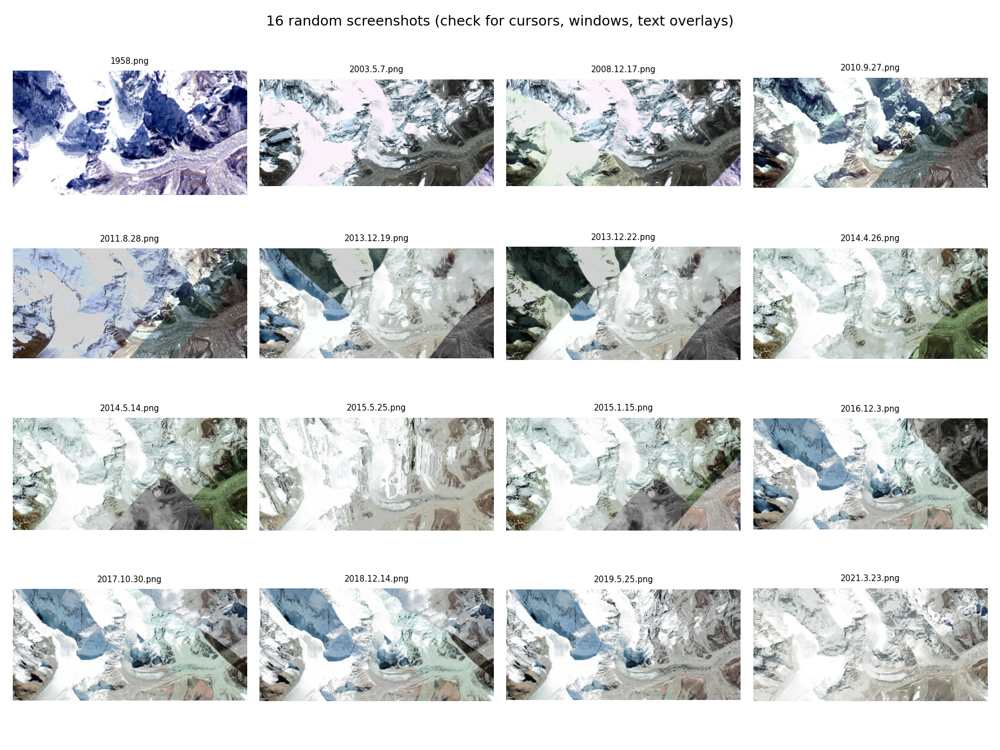
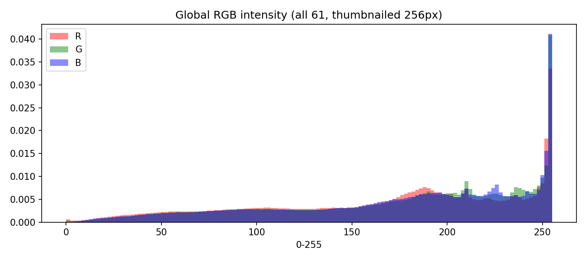
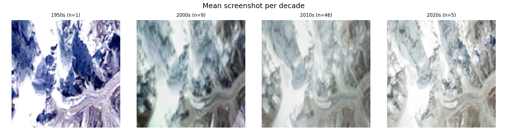
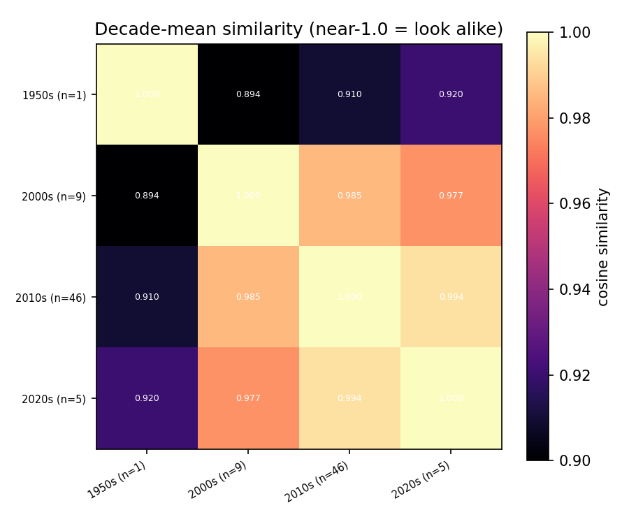
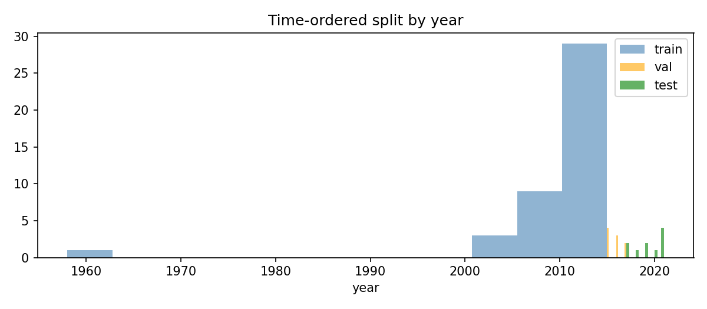

# EDA_Report — CNN Image Classification (Unlabeled Screenshots)

Re-runnable notebook: `eda.ipynb` (run top-to-bottom; executed copy: `eda.executed.ipynb`). Figures: `outputs/figures/`. Index: `outputs/file_index.csv`. Split: `outputs/split.csv`. Summary: `outputs/eda_summary.json`.

## 1. DATASET CARD

- Dataset name: user screenshots (no public name).
- Location: `D:\TECH project\dataset\` — 61 × `.png`, flat folder, no subfolders.
- Format: folders-per-class? No. CSV with labels? No. Just PNGs named as dates (`1958.png`, `2003.2.24.png` … `2021.11.13.png`).
- Classes: 0 — unlabeled by design (proceeded unlabeled per request).
- Size on disk: 119.2 MB. Samples: 61, no pre-split (train/val/test created in §6).
- Source: user-provided screenshots — no URL (user confirmed "no urls, i screenshotted those images").
- License: private / own screenshots — N/A.
- Collection: screen-captures; filename year (1958→2021, mean 2012.9) is a timestamp, not a label.
- Limitations: (1) UI artifacts possible (cursor, window chrome, text); (2) all RGBA with useless alpha; (3) 52 unique sizes for 61 shots (window resized between captures); (4) heavy era skew (1950s:1, 2000s:9, 2010s:46, 2020s:5); (5) no ground truth → supervised classification metrics don't apply.

## 2. LOAD & INSPECT

Code (`eda.ipynb`, §2): open each PNG with `Image.open(p).convert('RGB')`, record width/height/mode + pixel mean/std/min/max into a DataFrame, save `outputs/file_index.csv`.

Output (actual run):

- shape: (61, 9); modes: `{'RGBA': 61}`; width 1442–1663 (mean 1628.7), height 742–792 (mean 772.3); pixel mean 97.6–234.7 (mean 173.6), std 26.3–78.2.
- 5 random records (seed 42):

| path | year | width | height | mean | std |
|---|---|---|---|---|---|
| dataset\1958.png | 1958 | 1442 | 766 | 168.3 | 74.3 |
| dataset\2008.12.17.png | 2008 | 1633 | 746 | 164.5 | 75.1 |
| dataset\2016.12.3.png | 2016 | 1641 | 777 | 169.9 | 68.1 |
| dataset\2014.4.26.png | 2014 | 1632 | 771 | 183.5 | 66.0 |
| dataset\2011.8.28.png | 2011 | 1632 | 767 | 157.1 | 62.7 |

Reading: screenshots are consistently wide (~2.1:1), bright (mean ~174/255), full-range (min 0, max ~254).

## 3. DATA QUALITY AUDIT

Code: SHA256 hash for exact duplicates; `Image.verify()` for corrupt; std<2 / all-black / all-white for degenerate.

Result: duplicate groups = 0, corrupt = 0, degenerate = 0, missing labels = ALL (expected — unlabeled).

Decision: nothing to drop. If corrupt appeared → drop (CNN dataloaders crash on them). If duplicates appeared → keep one copy (duplicates cause memorization + leak across splits). If degenerate appeared → quarantine for visual check, drop only on proven sensor error. Stated here so the rule is auditable on re-run.

## 4. CLASS / TARGET DISTRIBUTION

No true classes exist, so imbalance is N/A. Two views plotted:

Left: single unlabeled group (n=61). Right: decade pseudo-groups for visualization only — 1950s:1, 2000s:9, 2010s:46, 2020s:5.

Effect on model: accuracy is meaningless unsupervised. If labels are added later, the 2010s dominance means a naive classifier would collapse to the majority — plan then is stratified sampling + class weights + macro-F1, not accuracy.

## 5. IMAGE-SPECIFIC EDA

### a. Size and channel distribution → target resolution

All 61 are RGBA; 52 unique sizes. Decision: model input **224×224 RGB**. Why: CNN needs fixed input; alpha channel carries no scene signal (screenshots); 224px is standard and downscales the ~1630×770 shots cheaply. Implement as RGBA→RGB + resize + center-crop (preserve aspect via crop, not squash).

### b. Sample grid per class (here: 16 random screenshots)

Visual check for cursors, window borders, overlaid text. Finding: content looks homogeneous across years (same view re-captured) — supports the similarity result in (d) and warns against heavy cropping/flipping that would cut UI edges or mirror text.

### c. Pixel intensity histograms per class (here: global RGB + decade overlay basis)

Global thumbnailed RGB mean = [169.5, 175.8, 175.5], std = [66.9, 65.6, 65.6] — bright, broad. Train-split values for normalization (computed from train only, 224px): mean [0.6419, 0.6689, 0.6687], std [0.2702, 0.2666, 0.2669]. Use these, not ImageNet stats, because screenshots have their own brightness.

### d. Mean image per class + similarity heatmap

Cosine similarity of 128px decade-means:

|  | 1950s | 2000s | 2010s | 2020s |
|---|---|---|---|---|
| 1950s | 1.000 | 0.894 | 0.910 | 0.920 |
| 2000s | 0.894 | 1.000 | 0.985 | 0.977 |
| 2010s | 0.910 | 0.985 | 1.000 | 0.994 |
| 2020s | 0.920 | 0.977 | 0.994 | 1.000 |

2010s vs 2020s = 0.994 — near-identical. Any era classifier will confuse these; monitor per-era errors.

## 6. TRAIN / VALIDATION / TEST SPLIT PLAN

No classes to stratify, no subject IDs to group — but filenames are time-ordered, so random splitting would leak eras. Implemented **time-ordered 70/15/15 by filename year** (sort → first 42 train, next 9 val, last 10 test), saved to `outputs/split.csv`.

Result: train 1958–2015 (42), val 2015–2017 (9), test 2017–2021 (10).

Justification: respects causality (future never trains past), avoids the 2010s/2020s near-duplicate leaking across splits. If subject/patient IDs appear later, switch to group split.

## 7. THREE KEY FINDINGS THAT CHANGE MODEL DESIGN

1. All 61 are RGBA with 52 sizes (evidence §5a, Fig 02). Decision: fixed 224×224 RGB input with RGBA→RGB + resize/center-crop — architecture choice, not optional.
2. 2010s/2020s decade-means cosine = 0.994 (evidence §5d, Fig 06). Decision: expect era confusion; use time-ordered split (§6) and report per-era errors rather than a single pooled score.
3. Screenshots with likely UI/text + bright custom distribution (evidence §5b grid, §5c histograms). Decision: train-only mean/std normalization ([0.6419,0.6689,0.6687]/[0.2702,0.2666,0.2669]); augmentation = small brightness/contrast + slight rotation only, NO horizontal flip or heavy crop.

## 8. FEATURE ENGINEERING / PREPROCESSING PLAN

Concrete pipeline (also in `outputs/eda_summary.json`):

- Channels: RGBA→RGB on load (alpha discarded).
- Resize: resize shorter side then 224×224 center-crop (handles 52 sizes uniformly).
- Normalize: `mean=[0.6419, 0.6689, 0.6687]`, `std=[0.2702, 0.2666, 0.2669]` computed from TRAIN split only at 224px, scaled 0–1.
- Color space: stay RGB (screenshots are color UI; no HSV/grayscale gain evidenced).
- Augment (train only): random brightness/contrast ±10%, rotation ±5°. No h-flip (text mirroring), no random crop >10% (UI edges carry signal), no cutout over potential labels.
- Split/metric: time-ordered 70/15/15; unsupervised → track reconstruction/temporal-consistency; if labeled later → stratified + class weights + macro-F1.
- Re-run: `jupyter nbconvert --to notebook --execute eda.ipynb` regenerates all figures + CSVs.
